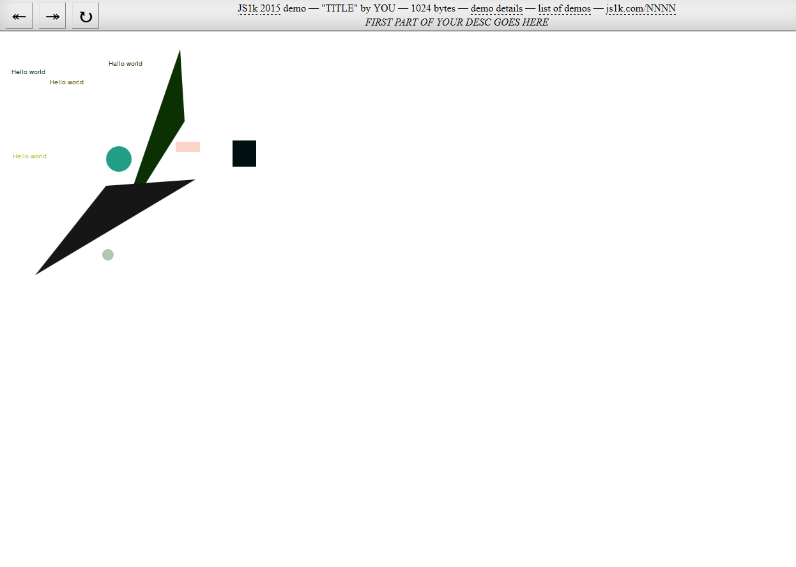

# js1k-macro

## A macro preprocessor for writing js1k entries

This is something I started - it's very much at prototyping stage but usable if you go to the trouble of figuring out how it works

The idea was to have a macro language where you could write sensible looking code that would then get massively inlined, and support reusing code for the benefit of the packer.

I'm popping it on Github in case it's useful to someone else or in case I pick it up again at some point in future

There are some example macros in the /lib and /bin folders

There are some example outputs in the /tmp folder

1k.js does the actual work

build.cmd takes a .1k file and generates javascript plus a shim html in the /tmp folder (sorry, windows .cmd, but works mostly the same as most other shells)

### JS1k output in shim



### Macro (2287 bytes)
```
!names defghijklmnopqrstuvwxyz

@data []

&current @data[ @arg1 ]

&each
  for( @arg1 = &shapeCount; @arg1--; )

&rect 0
&circle 1
&path 2
&text 3  

&type 0
&color 1
&x 2
&y 3
&width 4
&height 5
&radius 4
&points 4
&str 4

&shapeCount 10

&boundsWidth 400
&boundsHeight 400

&currentType &current[ &type ]
&currentColor &current[ &color ]
&currentX &current[ &x ]
&currentY &current[ &y ]
&currentWidth &current[ &width ]
&currentHeight &current[ &height ]
&currentRadius &current[ &radius ]
&currentPoints &current[ &points ]
&currentString &current[ &str ]

&context c

&newRandom @random = Math.random()

&randomType ~~( @random * 4 )
&randomColor 'hsl(' + ~~( Math.random() * 360 ) + ',' + ~~( Math.random() * 100 ) + '%,' + ~~( Math.random() * 100 ) + '%)'
&randomX ~~( Math.random() * &boundsWidth )
&randomY ~~( Math.random() * &boundsHeight )
&randomWidth ~~( Math.random() * 50 )
&randomHeight ~~( Math.random() * 50 )
&randomRadius ~~( Math.random() * 25 )

_drawPath
  &context.beginPath();
  &context.moveTo( &currentPoints[ 0 ], &currentPoints[ 1 ] );
  for( @arg2 = &currentPoints.length / 2; @arg2--; )
    &context.lineTo( &currentPoints[ @arg2 * 2 ], &currentPoints[ @arg2 * 2 + 1 ] );
  &context.fill()
  
&blit
  &each
    &context.fillStyle = &currentColor,
      &currentType == &rect ?
        &context.fillRect( &currentX, &currentY, &currentWidth, &currentHeight ) :
        &currentType == &circle ? (
          &context.beginPath(), 
          &context.arc(
            &currentX,
            &currentY,
            &currentRadius, 
            0, 
            7
          ), 
          &context.fill()
        ) :
          &currentType == &text ? (
            &context.fillText( &currentString, &currentX, &currentY )
          ) : _drawPath( @arg1 )
          
    

&randomShape
  &newRandom,
  &current = [
    &randomType,
    &randomColor,
    &randomX,
    &randomY,
    &randomType == &circle ? 
      &randomRadius : 
      &randomType == &path ? 
        [ &randomX, &randomY, &randomX, &randomY, &randomX, &randomY ] : 
        &randomType == &text ? 
        'Hello world' : &randomWidth,
    &randomHeight
  ]
  
main
  &each &randomShape;
  &blit
```

### JavaScript (1363 bytes)
```javascript
h = function( d, e ){
  c.beginPath();
  c.moveTo( f[ d ][ 4 ][ 0 ], f[ d ][ 4 ][ 1 ] );
  for( e = f[ d ][ 4 ].length / 2; e--; )
    c.lineTo( f[ d ][ 4 ][ e * 2 ], f[ d ][ 4 ][ e * 2 + 1 ] );
  c.fill()
};
f = [];
for( d = 10; d--; ) g = Math.random(),
  f[ d ] = [
    ~~( g * 4 ),
    'hsl(' + ~~( Math.random() * 360 ) + ',' + ~~( Math.random() * 100 ) + '%,' + ~~( Math.random() * 100 ) + '%)',
    ~~( Math.random() * 400 ),
    ~~( Math.random() * 400 ),
    ~~( g * 4 ) == 1 ? 
      ~~( Math.random() * 25 ) : 
      ~~( g * 4 ) == 2 ? 
        [ ~~( Math.random() * 400 ), ~~( Math.random() * 400 ), ~~( Math.random() * 400 ), ~~( Math.random() * 400 ), ~~( Math.random() * 400 ), ~~( Math.random() * 400 ) ] : 
        ~~( g * 4 ) == 3 ? 
        'Hello world' : ~~( Math.random() * 50 ),
    ~~( Math.random() * 50 )
  ];
  for( d = 10; d--; )
    c.fillStyle = f[ d ][ 1 ],
      f[ d ][ 0 ] == 0 ?
        c.fillRect( f[ d ][ 2 ], f[ d ][ 3 ], f[ d ][ 4 ], f[ d ][ 5 ] ) :
        f[ d ][ 0 ] == 1 ? (
          c.beginPath(), 
          c.arc(
            f[ d ][ 2 ],
            f[ d ][ 3 ],
            f[ d ][ 4 ], 
            0, 
            7
          ), 
          c.fill()
        ) :
          f[ d ][ 0 ] == 3 ? (
            c.fillText( f[ d ][ 4 ], f[ d ][ 2 ], f[ d ][ 3 ] )
          ) : h( d )
```

### Packed (423 bytes)
```javascript
for(_=";for(~~(g*4)==4][c.0)f[d][],(2340]==	eTo(Math.random()~~(*,'+10+'%beginPath()]d=10;d--;)fill,40h=function(d,e){;mov01])e=4].length/2;e--;)line*2e*2+1]);()};f=[g=,f[d]=[,'hsl('+36+')',1?25):2?[40]:3?'Helloworld':5,5Style=1	0?Rect5]):	1?(,arc],0,7),()):	3?(Text(423])):h(d)";g=/[-]/.exec(_);)with(_.split(g))_=join(shift());eval(_)
```